# PromptLens Design Reference

Implementation-based design reference for future contributors.

Last reviewed: 2026-03-23

## Purpose

This document describes the design system and UX patterns that are actually implemented in the repo today. It should be used as a practical reference when changing UI, extending the extension, or aligning future mockups with the current product.

Use this alongside:

- `docs/UI_STYLE_GUIDE.md` for the intended style direction
- `docs/ARCHITECTURE.md` for structural architecture
- `docs/PromptLens_Design_Planning.md` for earlier aspirational planning

If those documents disagree with the code, treat this file and the source files it references as the current truth.

## Product Surfaces

| Surface | Main entry points | Role |
| --- | --- | --- |
| Marketing site | `apps/web/src/app/page.tsx`, `apps/web/src/components/*` | Public-facing landing page and product positioning |
| Extension popup | `apps/extension/src/popup/App.tsx` | Compact control panel for auth, active model, and quick links |
| Extension options | `apps/extension/src/options/App.tsx`, `apps/extension/src/components/*` | Full settings surface for model config and preferences |
| Inline suggestion UI | `apps/extension/src/content/index.ts`, `apps/extension/src/content/ui/*` | In-page badge, popover, and ghost text experience inside supported chat products |
| Shared UI primitives | `packages/ui/src/components/*`, `packages/ui/src/styles.css` | Reusable buttons, cards, inputs, selects, badges, separators, and base tokens |
| VS Code extension | `apps/vscode/src/extension.ts` | Command-only integration today; no meaningful visual system yet |

## Design Principles In The Current Build

### 1. Technical, not ornamental

The UI is intentionally operational. Most surfaces feel like tools or control panels rather than lifestyle product marketing.

- Section framing is done with borders instead of heavy decoration.
- State is surfaced with labels, badges, and explicit helper text.
- Content density is moderate to high, especially in the extension.

### 2. Light-first, flat, and border-defined

PromptLens currently implements a light-first system across the web app and browser extension.

- Main surfaces are warm off-white rather than pure white.
- Borders do most of the separation work.
- App surfaces avoid shadows almost entirely.
- The content-script popover is the exception: it uses a subtle shadow so it can float above arbitrary host websites.

### 3. Sans for narrative, mono for metadata

The type system is simple and consistent:

- `Space Grotesk` is the brand sans for headlines and body copy.
- `IBM Plex Mono` is the metadata font for labels, status text, shortcut hints, and small operational copy.
- Mono text is usually uppercase with increased tracking.

### 4. Keyboard-first interaction

The inline suggestion flow is built around keyboard use:

- `Tab` accepts the active suggestion.
- `Esc` dismisses the overlay.
- `ArrowUp` and `ArrowDown` move between suggestions.
- Settings and popup controls are built from standard focusable primitives.

### 5. Explicit trust cues

Privacy and storage choices are made visible in the interface instead of hidden in docs.

- Sign-in and sync availability are surfaced directly in settings.
- Sync status has named states such as `Synced`, `Local only`, `Syncing`, and `Error`.
- Helper copy explains whether data is local, Chrome Sync-backed, or Firebase-backed.

### 6. Shared primitives, app-level personality

`packages/ui` provides generic shadcn-style primitives, but both product surfaces restyle them through app-level tokens:

- `apps/web/src/app/globals.css`
- `apps/extension/src/index.css`

This means the primitives stay reusable while the PromptLens look remains centralized.

## Visual System

### Token layering

There are three token layers in the repo:

1. Base primitive tokens in `packages/ui/src/styles.css`
2. PromptLens overrides for web and extension app chrome in:
   - `apps/web/src/app/globals.css`
   - `apps/extension/src/index.css`
3. Content-script-only tokens in `apps/extension/src/content/ui/styles.css`

### Core PromptLens app tokens

These are the main product tokens used by the landing page and extension settings surfaces.

| Token | Current role | Value |
| --- | --- | --- |
| `--background` | App canvas | `oklch(0.995 0.001 95)` |
| `--foreground` | Primary text | `oklch(0.19 0.004 56)` |
| `--card` | Panel background | `oklch(1 0.001 95)` |
| `--primary` | Primary action fill | `oklch(0.19 0.004 56)` |
| `--primary-foreground` | Text on primary actions | `oklch(0.995 0.001 95)` |
| `--accent-signal` | Attention/status accent | `oklch(0.69 0.19 55)` |
| `--accent-secondary` | Secondary positive/support accent | `oklch(0.57 0.09 196)` |
| `--muted` | Soft panel fill | `oklch(0.968 0.002 95)` |
| `--muted-foreground` | Secondary copy | `oklch(0.5 0.005 95)` |
| `--border` | Structural lines | `oklch(0.87 0.004 95)` |
| `--input` | Input border/fill reference | `oklch(0.89 0.004 95)` |
| `--ring` | Focus ring | `oklch(0.69 0.19 55)` |
| `--radius` | Base rounding | `0.375rem` |

### Content overlay tokens

The inline overlay uses its own CSS token set because it renders inside host sites through shadow DOM.

| Token | Current role | Value |
| --- | --- | --- |
| `--pl-bg-primary` | Popover background | `#ffffff` |
| `--pl-bg-secondary` | Suggestion card fill | `#f7f7f3` |
| `--pl-bg-hover` | Hover state | `#efefe9` |
| `--pl-text-primary` | Main overlay text | `#171717` |
| `--pl-text-secondary` | Secondary overlay text | `#606059` |
| `--pl-accent` | Orange action accent | `#f97316` |
| `--pl-accent-secondary` | Teal support accent | `#0f766e` |
| `--pl-border` | Overlay border | `#d6d6ce` |
| `--pl-radius-sm` | Small rounding | `4px` |
| `--pl-radius-md` | Default overlay rounding | `6px` |
| `--pl-radius-lg` | Large rounding | `8px` |

### Typography roles

| Role | Implementation |
| --- | --- |
| Headline/body font | `Space Grotesk` in web layout, plus extension fallback stack via CSS variables |
| Mono/metadata font | `IBM Plex Mono` in web layout, plus extension fallback stack via CSS variables |
| Section labels | Mono, uppercase, tracked, usually `10px` to `11px` |
| Status badges | Mono, uppercase, compact, often outline style |
| Hero and section headlines | Sans, bold, tight tracking |
| Supporting copy | Sans, muted, relaxed leading |

### Shape, borders, and depth

- Main app surfaces use small to medium rounding, usually `rounded-sm` or `rounded-md`.
- Cards are mostly flat and often override primitive defaults with `shadow-none`.
- Bordered sections are more common than nested tinted panels.
- The inline suggestion popover uses a shadow stack because it must read as floating above the host page.

### Background treatment

Only the marketing site adds atmospheric treatment:

- `apps/web/src/app/page.tsx` renders a fixed grid background.
- Grid size is `52px x 52px`.
- Opacity is low enough that content still feels crisp and technical.

The extension popup and options page stay much plainer to preserve clarity in tighter spaces.

## Shared Component Language

### Buttons

Source: `packages/ui/src/components/button.tsx`

Current usage pattern:

- `default`: dark fill, white text, used for primary actions
- `outline`: bordered, background-colored secondary action
- `icon` and `icon-sm`: used for compact utility controls such as the popup settings button
- `lg`: used for web CTAs

PromptLens-specific conventions:

- Primary buttons should be sparse and obvious.
- Outline buttons are used for secondary actions, connection tests, and external links.
- Icon-leading buttons use the `data-icon="inline-start"` pattern in the consuming markup.

### Badges

Source: `packages/ui/src/components/badge.tsx`

Current usage pattern:

- Most product badges use `variant="outline"` and then custom border/text colors.
- Orange badges indicate active or attention-worthy states.
- Teal badges indicate successful sync/healthy states.

### Cards

Source: `packages/ui/src/components/card.tsx`

Current usage pattern:

- Cards are the main container for popup sections, options sections, and web feature tiles.
- PromptLens often overrides the primitive defaults to remove shadow and tighten spacing.
- Many cards use a header with a bottom border to create a control-panel feel.

### Inputs and selects

Sources:

- `packages/ui/src/components/input.tsx`
- `packages/ui/src/components/select.tsx`
- `packages/ui/src/components/label.tsx`

Current usage pattern:

- Controls are full-width in extension settings.
- Label and control rows often become two columns on wider screens.
- Selects are the main mechanism for provider and model choice.
- Inputs are visually quiet and rely on border/focus ring rather than fill color.

### Separators and skeletons

Sources:

- `packages/ui/src/components/separator.tsx`
- `packages/ui/src/components/skeleton.tsx`

Current usage pattern:

- Separators divide popup sections and footer blocks.
- Skeletons are used for auth and model-loading states instead of spinners inside every section.

### Utility class

Source: `apps/web/src/app/globals.css`

`mono-label` exists as a reusable utility for small uppercase mono metadata labels, although many components still inline equivalent classes directly.

## Surface Patterns

### Marketing site

Source files:

- `apps/web/src/app/page.tsx`
- `apps/web/src/components/navbar.tsx`
- `apps/web/src/components/hero.tsx`
- `apps/web/src/components/features.tsx`
- `apps/web/src/components/how-it-works.tsx`
- `apps/web/src/components/platforms.tsx`
- `apps/web/src/components/cta.tsx`
- `apps/web/src/components/footer.tsx`

Implemented pattern:

- Sticky bordered navbar
- Large hero with one strong headline and a bordered live-preview panel
- Repeating section rhythm:
  - border-bottom wrapper
  - intro block with mono label, headline, and short explainer
  - content grid below
- CTA section uses the same bordered panel language rather than a distinct visual campaign treatment
- Footer stays consistent with the rest of the system instead of switching style

What makes the web surface feel like PromptLens:

- Border grid background
- Strong use of mono metadata labels
- Flat cards with dense content blocks
- Operational copy such as `Capability map`, `Setup sequence`, and `Deploy now`

### Extension popup

Source: `apps/extension/src/popup/App.tsx`

Implemented pattern:

- Fixed compact width: `w-80`
- Outer shell is simply a bordered panel
- Card primitives are flattened into a near-frame layout
- Sections are stacked vertically with light dividers and small mono headings

Current section order:

1. Header with logo, product name, and settings icon
2. Account/auth status
3. Active model selector and configured badge
4. Conditional configuration warning if no active model is ready
5. External links
6. Small mono footer with product name and version

Popup tone:

- Utility first
- Minimal narrative copy
- Strong emphasis on "what is configured right now"

### Extension options page

Source files:

- `apps/extension/src/options/App.tsx`
- `apps/extension/src/components/ModelConfig.tsx`
- `apps/extension/src/components/AuthStatus.tsx`

Implemented pattern:

- Spacious centered column with `max-w-4xl`
- Stacked bordered cards instead of tabs or sidebars
- Card headers are mono and uppercase with a border-bottom
- Form sections use consistent row-based label/control layouts on larger screens

Primary settings patterns:

- Account status appears in the top summary card
- Model configuration is the main operational area
- General preferences are separated into their own card
- Helper copy is always adjacent to the control it explains

Model configuration specifics:

- Sync method is presented as two selectable bordered tiles
- Provider and model are treated as top-level configuration rows
- Custom providers reveal a `Base URL` row
- API key is always a dedicated row
- Save/test state is communicated through badges and helper copy rather than modal flows

### Inline suggestion UI

Source files:

- `apps/extension/src/content/index.ts`
- `apps/extension/src/content/ui/SuggestionOverlay.ts`
- `apps/extension/src/content/ui/GhostOverlay.ts`
- `apps/extension/src/content/ui/BadgeIndicator.ts`
- `apps/extension/src/content/ui/styles.css`

Implemented pattern:

- Input discovery is platform-driven and re-attached when the host DOM changes
- Suggestions appear after a typing pause and are tied to a specific input container
- The experience has three visual forms:
  - badge count
  - popover list
  - ghost completion

Popover structure:

1. Header with orange mono title and close affordance
2. Scrollable suggestion list
3. Footer with keyboard hints

Popover behavior:

- Width is clamped between `320px` and `600px`
- Position is anchored above or below the input based on available space
- The active suggestion is orange-tinted
- Clicking an item selects and applies it

Ghost completion behavior:

- Only the top suggestion is used
- It appears only when the suggestion begins with the user’s current text
- Typography and padding are mirrored from the live input to preserve alignment

Badge behavior:

- Badge appears inside the input container
- Orange pill treatment communicates attention without blocking the text field
- Clicking the badge opens the full overlay

## Interaction Flow

```mermaid
flowchart LR
  A["User types in supported input"] --> B["Debounce preference applied"]
  B --> C["Content script requests analysis"]
  C --> D["Background router runs local analysis"]
  D --> E["Optional provider enrichment using active model"]
  E --> F["Suggestions returned to content script"]
  F --> G["Badge, popover, and ghost UI updated"]
  G --> H["Tab accept or click apply"]
  H --> I["Input replaced and UI cleared"]
```

## UX States And Messaging

### Auth states

Source: `apps/extension/src/components/AuthStatus.tsx`

- Loading: skeleton row
- Signed out: full-width `Sign in with Google` button
- Signed in: compact identity row with avatar/initials, name, email, and `Sign out`

### Model setup states

Sources:

- `apps/extension/src/popup/App.tsx`
- `apps/extension/src/components/ModelConfig.tsx`

Implemented states:

- Not configured: warning copy plus `Configure model` action in popup
- Configured: `Configured` badge appears near the active model selector
- Testing: button label changes to `Testing...`
- Healthy connection: success banner plus `Healthy` badge
- Failed connection: error banner plus `Error` badge

### Sync states

Source: `apps/extension/src/components/ModelConfig.tsx`

Sync state language is explicit and user-readable:

- `Synced`
- `Local only`
- `Syncing`
- `Error`

This is one of the clearest examples of the product's design philosophy: invisible infrastructure is still given visible names.

### Inline suggestion states

Source: `apps/extension/src/content/index.ts`

Important behavioral details:

- Suggestions do not show until input length reaches 10 characters
- Default debounce is 500ms
- Badge shows `...` while analyzing
- Overlay and ghost text are cleared as soon as typing resumes

## Layout Rules That Repeat Across The Codebase

- Prefer `flex flex-col gap-*` and grid layouts over ad hoc margin stacking.
- Use mono uppercase labels for section intros, statuses, and small metadata.
- Keep control rows simple: label on the left, control on the right at larger breakpoints.
- Keep primary actions visually scarce.
- Prefer full-width controls in compact extension contexts.
- Use bordered cards as the main grouping device.

## Current Implementation Caveats

These are useful to know before making new design decisions.

### This repo has planning docs that exceed the shipped UI

The older PRD, design-planning, and tech-planning docs describe features that are not fully implemented yet, including:

- full onboarding flow
- platform-adaptive visual theming
- dark-mode surface parity
- stats-heavy popup states
- richer options navigation

Those docs are still valuable for intent, but they are not the current UI source of truth.

### The shared primitive package still contains generic light and dark tokens

`packages/ui/src/styles.css` includes generic shadcn-style light/dark tokens. PromptLens then overrides those tokens at the app level. When styling PromptLens surfaces, start from the app token files rather than the package defaults.

### The content overlay is visually close to the product system, but not identical

The content script uses:

- its own CSS token file
- a slightly different radius scale
- a visible shadow stack
- direct DOM rendering instead of React/Preact primitives

This is intentional because the overlay must survive unknown host page styles.

### Perplexity support is partially wired

`apps/extension/src/content/platforms/registry.ts` includes a Perplexity config, but `apps/extension/public/manifest.json` currently injects the content script only on:

- `chatgpt.com`
- `chat.openai.com`
- `claude.ai`
- `gemini.google.com`

Treat Perplexity as in-progress in the live extension footprint unless the manifest is updated.

### There is an unused starter app in the extension workspace

`apps/extension/src/app.tsx` and `apps/extension/src/main.tsx` still contain the Vite starter app and are not the main popup or options experience. The actual extension surfaces use:

- `apps/extension/src/popup/main.tsx`
- `apps/extension/src/options/main.tsx`

## Change Guidelines For Future Work

When changing or adding UI, use this checklist:

1. Start with shared primitives from `@promptlens/ui` unless the surface is a content-script overlay.
2. Prefer updating app tokens in `globals.css` or `index.css` before introducing one-off component colors.
3. Keep panels flat, bordered, and legible at extension scale.
4. Use mono uppercase metadata labels to preserve the control-panel feel.
5. Reserve orange for active, warning, or attention states; reserve teal for healthy or synced states.
6. Keep status copy explicit. Users should understand where data is stored and whether a model is ready.
7. Test new UI at popup width, options-page desktop width, and mobile web width.
8. If a change affects the inline overlay, validate that it still reads clearly against arbitrary host pages.
9. Update this file when changing core design language, control patterns, or major flows.

## Source Of Truth File Map

| Area | Primary files |
| --- | --- |
| Product-level tokens | `apps/web/src/app/globals.css`, `apps/extension/src/index.css` |
| Shared primitive defaults | `packages/ui/src/styles.css` |
| Shared components | `packages/ui/src/components/*` |
| Landing page structure | `apps/web/src/app/page.tsx`, `apps/web/src/components/*` |
| Popup layout | `apps/extension/src/popup/App.tsx` |
| Options layout | `apps/extension/src/options/App.tsx` |
| Auth UI | `apps/extension/src/components/AuthStatus.tsx` |
| Model config UI | `apps/extension/src/components/ModelConfig.tsx` |
| Inline overlay visuals | `apps/extension/src/content/ui/*` |
| Inline interaction orchestration | `apps/extension/src/content/index.ts` |

## Summary

PromptLens currently presents itself as a calm technical tool:

- light-first
- flat and border-led
- keyboard-first
- privacy-explicit
- built from shared primitives with app-level token overrides

Future design work should preserve that operational clarity even when new features add more complexity.
